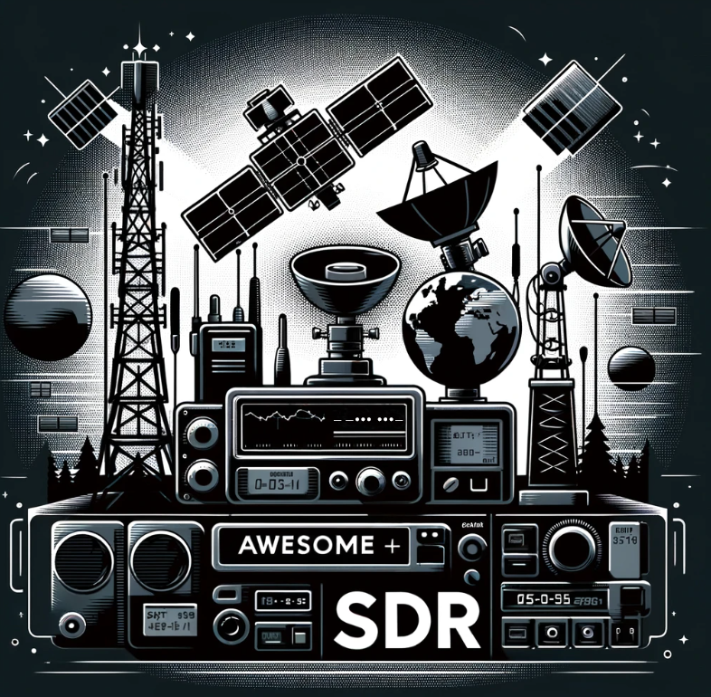

# # Awesome Software Defined Radio (SDR)

> It's a repository related to SDR, amateur radio, satellites and similar topics. I know there are missing pieces and I plan to add all of them.

_&nbsp;_

# Tools

**GENERAL PURPOSE SDR Software**
 _&nbsp;_
	
[SDRAngel:](https://www.sdrangel.org/) – Open-source TX & RX Software Defined Radio  

[GNU Radio](https://www.gnuradio.org/): GNU Radio is a free & open-source software development toolkit that provides signal processing blocks to implement software radios. It can be used with readily-available, low-cost external RF hardware to create software-defined radios, or without hardware in a simulation-like environment.

[SDR# (SDRSharp)](https://airspy.com/download/): Popular software application for Software Defined Radio (SDR), It offers a comprehensive, user-friendly interface for monitoring and analyzing radio frequencies. SDR# supports a wide range of SDR hardware, making it a versatile choice for enthusiasts and professionals alike.

[Gqrx SDR](https://www.gqrx.dk/): Gqrx is an open source software defined radio receiver (SDR) powered by the GNU Radio and the Qt graphical toolkit. Gqrx supports many of the SDR hardware available, including Airspy, Funcube Dongles, rtl-sdr, HackRF and USRP devices

[CubicSDR](https://cubicsdr.com/): CubicSDR is the software portion of  _Software Defined Radio_. By Using hardware that converts RF spectrum into a digital stream we are able to build complex radios to do many types of functions in software instead of traditional hardwire.

[HDSDR](https://www.hdsdr.de/): HDSDR is a freeware Software Defined Radio (SDR) program for Microsoft Windows 2000/XP/Vista/7/8/10/11. Typical applications are Radio listening, Ham Radio, SWL, Radio Astronomy, NDB-hunting and Spectrum analysis.

[SDR++](https://github.com/AlexandreRouma/SDRPlusPlus):  SDR++ is a cross-platform and open source SDR software with the aim of being bloat free and simple to use.

[ShinySDR:](https://github.com/kpreid/shinysdr) ShinySDR is the software component of a software-defined radio receiver. When combined with suitable hardware devices such as the RTL-SDR, HackRF, or USRP, it can be used to listen to or display data from a variety of radio transmissions.

[GNSS-SDR:](https://github.com/gnss-sdr/gnss-sdr) GNSS-SDR is an open-source project that implements a global navigation satellite system software-defined receiver in C++. With GNSS-SDR, users can build a GNSS software receiver by creating a graph where the nodes are signal processing blocks and the lines represent the data flow between them. The software provides an interface to different suitable RF front-ends and implements all the receiver’s chain up to the navigation solution. Its design allows any kind of customization, including interchangeability of signal sources, signal processing algorithms, interoperability with other systems, output formats, and offers interfaces to all the intermediate signals, parameters, and variables.

[sdrtrunk:](https://github.com/DSheirer/sdrtrunk) A cross-platform java application for decoding, monitoring, recording and streaming trunked mobile and related radio protocols using Software Defined Radios (SDR).

[LocalRadio](https://github.com/dsward2/LocalRadio): is "Radio for Cord-Cutters", an experimental, GPL-2 licensed open-source application for listening to "software defined radio" on your Mac and mobile devices. With an inexpensive RTL-SDR device plugged into the Mac's USB port, LocalRadio provides a casual listening experience for your favorite local FM broadcasts, free music, news, sports, weather, public safety and aviation scanner monitoring, and other radio sources.

_&nbsp;_

## Satellite Apps

[SatDump:](https://github.com/SatDump/SatDump)  A generic satellite data processing software.

[goestools](https://github.com/pietern/goestools): Tools to work with signals and files from GOES satellites

[Gpredict](https://oz9aec.dk/gpredict/): Real-time satellite tracking and orbit prediction application. It can track a large number of satellites and display their position and other data in lists, tables, maps, and polar plots (radar view). Gpredict can also predict the time of future passes for a satellite, and provide you with detailed information about each pass.

_&nbsp;_

## **Spectrum Analyzers (Signal Analyzers)**

[Universal Radio Hacker (URH)](https://github.com/jopohl/urh): The Universal Radio Hacker (URH) is a complete suite for wireless protocol investigation with native support for [many](https://github.com/jopohl/urh/wiki/Supported-devices) common **Software Defined Radios**. URH allows **easy demodulation** of signals combined with an [automatic](https://dl.acm.org/doi/10.1145/3375894.3375896) detection of modulation parameters making it a breeze to identify the bits and bytes that fly over the air. As data often gets _encoded_ before transmission, URH offers **customizable decodings** to crack even sophisticated encodings like CC1101 data whitening.

[Inspectrum:](https://github.com/miek/inspectrum) Inspectrum is a tool for analysing captured signals, primarily from software-defined radio receivers.

[SigDigger:](https://github.com/BatchDrake/SigDigger) SigDigger is a free digital signal analyzer for GNU/Linux and macOS, designed to extract information of unknown radio signals. It supports a variety of SDR devices through SoapySDR, and allows adjustable demodulation of FSK, PSK and ASK signals, decode analog video, analyze bursty signals and listen to analog voice channels (all in real time).

_&nbsp;_

## PROTOCOLS

### GSM / 4G / 5G

GSM (Global System for Mobile Communications), 4G (the fourth generation of broadband cellular network technology), and 5G (the fifth generation) are standards for mobile communications that define the technology for cellular networks, including the radio frequencies used and how data is transmitted over these networks.

### GSM

-   GSM is the second-generation (2G) mobile network standard and was the first digital standard, introduced in the early 1990s. It replaced the first-generation (1G) analog systems.
-   GSM networks use a variation of time division multiple access (TDMA) and are primarily used for voice communication and SMS (Short Message Service).
-   GSM phones use a SIM card to identify the user to the network.
-   While it's largely been phased out in favor of more advanced technologies, GSM networks are still in use in various parts of the world for basic mobile communications.

### 4G

-   4G stands for the fourth generation of mobile telecommunications technology, succeeding 3G. It was designed to provide IP-based voice, data, and multimedia streaming at speeds of at least 100 megabits per second (Mbps) and up to 1 gigabit per second (Gbps).
-   4G has been deployed in many countries and supports high-definition mobile TV, video conferencing, and high-speed internet access.
-   The primary technologies underpinning 4G networks are LTE (Long-Term Evolution) and WiMAX (Worldwide Interoperability for Microwave Access).

### 5G

-   5G is the latest generation of cellular network technology, designed to increase speed, reduce latency, and improve flexibility of wireless services. It has a theoretical peak speed of 20 Gbps.
-   5G technology is expected to support a vast network of sensors and smart devices, with applications ranging from enhanced mobile broadband to mission-critical communications and the massive Internet of Things (IoT).
-   The deployment of 5G networks began in 2019 and is ongoing, with widespread availability expected to grow over the coming years. It utilizes a set of new technologies, including massive MIMO (Multiple Input Multiple Output), beamforming, and network slicing, to achieve its improvements over 4G.

Each generation has been developed to provide more bandwidth, faster speeds, and enhanced functionalities to support the growing demands of mobile users and to enable new applications, from mobile internet access and multimedia communication to the digital economy and smart infrastructure.

[srsRAN 4G:](https://github.com/srsran/srsRAN_4G) Open source SDR 4G software suite from Software Radio Systems (SRS)

[Open5GS:](https://open5gs.org/) This project can be used to configure your own NR/LTE network. If gNB/eNB and USIM are available, you can build a private network using Open5GS. Open5GS implemented 5GC and EPC using C-language. And WebUI is provided for testing purposes and is implemented in Node.JS and React.

[YateBTS](https://yatebts.com/open_source/): is an open source GSM Base Station software.

_&nbsp;_

### Bluetooth Low Energy (BLE)

Bluetooth Low Energy (BLE), also known as Bluetooth Smart, is a wireless personal area network technology designed and marketed by the Bluetooth Special Interest Group (SIG) for novel applications in the healthcare, fitness, beacons, security, and home entertainment industries. Introduced as part of the Bluetooth 4.0 core specification, BLE is distinct from the classic Bluetooth (Bluetooth BR/EDR) by its focus on low power consumption while maintaining a similar communication range.

### Key Features of BLE

-   **Low Power Consumption**: BLE is optimized for low power consumption, making it ideal for battery-operated or energy-harvesting devices that need to operate for months or years on a single battery charge.
-   **Short-Range Communication**: Typically, BLE devices can communicate over distances of up to 50 meters (164 feet) or more in open spaces, making it suitable for short-range applications.
-   **Low Cost**: BLE devices are relatively inexpensive to manufacture, which helps reduce the cost of implementing Bluetooth technology in products.

[BTLE:](https://github.com/JiaoXianjun/BTLE) BTLE is a free and open-source Software Defined Radio Bluetooth Low Energy (BLE) software suite.

[RxAndroidBle](https://github.com/dariuszseweryn/RxAndroidBle): An Android Bluetooth Low Energy (BLE) Library with RxJava3 interface

[btlejack](https://github.com/virtualabs/btlejack): Bluetooth Low Energy Swiss-army knife

[Wall-of-Flippers](https://github.com/K3YOMI/Wall-of-Flippers): A simple and easy way to find Flipper Zero Devices and Bluetooth Low Energy Based Attacks

_&nbsp;_

### AIS

AIS, or Automatic Identification System, is a tracking system used on ships and by vessel traffic services (VTS) for identifying and locating vessels by electronically exchanging data with other nearby ships, VTS, and AIS base stations. The system is designed to provide safety at sea by assisting in the avoidance of ship collisions and by allowing maritime authorities to track and monitor vessel movements.

There are several types of AIS devices, including:

-   **Class A AIS**: Used by commercial vessels and certain types of ships as required by international regulations. It transmits at a higher power and provides a more comprehensive range of data more frequently than Class B.
-   **Class B AIS**: Designed for non-SOLAS vessels, such as leisure craft and smaller ships. It transmits less data at a lower power and less frequently than Class A.
-   **AIS Base Stations**: Located on shore, used for monitoring and communicating with vessels within their range.

AIS uses two VHF radio frequencies: 161.975 MHz (AIS channel 87B) and 162.025 MHz (AIS channel 88B). These frequencies allow the system to operate in a high-traffic environment, ensuring that the AIS messages are reliably transmitted and received over the VHF data link.

[AIS (Automatic Identification System) overview](https://shipping.nato.int/nsc/operations/news/2021/ais-automatic-identification-system-overview): The Automatic Identification System (AIS) is a short-range coastal tracking system currently used on ships. It was developed to provide identification and positioning information to both vessels and shore stations.

[How AIS Works](https://www.navcen.uscg.gov/how-ais-works): Each AIS system consists of one [VHF](https://www.navcen.uscg.gov/how-ais-works?pageName=vhfnb) transmitter, two VHF [TDMA](http://en.wikipedia.org/wiki/Time_division_multiple_access) receivers, one VHF [DSC](https://www.navcen.uscg.gov/how-ais-works?pageName=AboutDSC) receiver, and standard marine electronic communications links ([IEC](https://www.navcen.uscg.gov/how-ais-works?pageName=AISReferences) 61162/NMEA 0183) to shipboard display and sensor systems ([AIS Schematic](https://www.navcen.uscg.gov/sites/default/files/pdf/AIS/IALA_AIS_ClassA_Schematic.pdf)). Position and timing information is normally derived from an integral or external global navigation satellite system (e.g. [GPS](https://www.navcen.uscg.gov/how-ais-works?pageName=GPSmain)) receiver, including a medium frequency differential [GNSS](https://en.wikipedia.org/wiki/Satellite_navigation) receiver for precise position in coastal and inland waters. Other information broadcast by the AIS, if available, is electronically obtained from shipboard equipment through standard marine data connections. Heading information and course and speed over ground would normally be provided by all AIS-equipped ships. Other information, such as rate of turn, angle of heel, pitch and roll, and destination and ETA could also be provided.

[AIS-catcher](https://github.com/jvde-github/AIS-catcher): AIS receiver for RTL SDR dongles, Airspy R2, Airspy Mini, Airspy HF+, HackRF, SDRplay and SoapySDR

[AISRecWinFull](https://sites.google.com/site/feverlaysoft/home): is a four-channel AIS receiver for Windows.

[SDRAngel AIS Plugin](https://github.com/f4exb/sdrangel/blob/master/plugins/feature/ais/readme.md): The AIS feature displays a table containing the most recent information about vessels, base-stations and aids-to-navigation, based on messages received via [AIS Demodulators](https://github.com/f4exb/sdrangel/blob/master/plugins/channelrx/demodais/readme.md). Typically the AIS feature would be used with two AIS Demodulators: one at 161.975MHz and 162.025MHz.

https://www.shipxplorer.com/ : Live Vessel Tracker and Port Status

_&nbsp;_

### Automatic Packet Reporting System - APRS

APRS, or Automatic Packet Reporting System, is a digital communications system that uses packet radio to send real-time data, including GPS location, weather data, telemetry, and messages over amateur radio frequencies. Primarily used by amateur radio operators, APRS enables the tracking of vehicles, equipment, and individuals, as well as the exchange of information relevant to the amateur radio community.

The primary frequency used for APRS in the United States is 144.390 MHz. Other countries may use different frequencies for APRS activity, depending on their national band plans and regulations. 

Europe: 144.800

[APRS PROTOCOL REFERENCE](http://www.aprs.org/doc/APRS101.PDF)

https://aprs.fi/ - live APRS map

[LoRa APRS Tracker](https://github.com/lora-aprs/LoRa_APRS_Tracker):  The LoRa APRS Tracker will work with very cheep hardware which you can buy from amazon, ebay or aliexpress. Try it out and be part of the APRS network.

[LoRa_APRS_iGate](https://github.com/lora-aprs/LoRa_APRS_iGate): This is a LoRa APRS iGate/Digi based on an ESP32

[SDRAngel APRS Feature Plugin](https://github.com/f4exb/sdrangel/tree/master/plugins/feature/aprs): The APRS plugin displays APRS (Automatic Packet Reporting System) packets. APRS packets can be received over RF via one or more Packet Demodulator or ChirpChat Demodulator source channels or from the Internet via an APRS-IS IGate.

[Build an Amateur Radio APRS RX Only IGate Using a Raspberry Pi and an RTL-SDR Dongle in Less Than Half an Hour](https://www.instructables.com/Build-an-Amateur-Radio-APRS-RX-Only-IGate-Using-a-/)

[Raspberry Pi based APRS Tracker/Digipeater/iGate](https://vk3il.net/projects/raspberry-pi-based-aprs-trackerdigipeaterigate/)

_&nbsp;_

### SSTV (Slow Scan Television)
SSTV, or Slow Scan Television, is a method used to transmit still images over radio frequencies, enabling the transmission of pictures between amateur radio operators and across distances where traditional communication methods might not be viable. Originally developed in the late 1950s, SSTV allows for the exchange of images in both black and white and color, using a variety of modes that differ in resolution and transmission time.

[ARISS SSTV gallery](https://www.spaceflightsoftware.com/ARISS_SSTV/index.php)

[Receiving Targeted Message From Russian Satellite](https://www.youtube.com/watch?v=WRl7ewRimIM)

[INTERNATIONAL SPACE STATION SSTV EVENT SCHEDULED FOR OCTOBER 9 AND 10](https://www.rtl-sdr.com/international-space-station-sstv-event-scheduled-for-october-9-and-10/)

[An SSTV decoder setup for Raspbian](https://github.com/davidhoness/sstv_decoder/blob/master/README.md)

[Receiving SSTV with an RTL-SDR](https://emar10.dev/posts/rtl-sdr-sstv/)

[QSSTV](https://github.com/ON4QZ/QSSTV): Receive and transmit images over radio using analog SSTV or digital DRM

_&nbsp;_

### DMR (Digital Mobile Radio)

DMR, or Digital Mobile Radio, is a digital communication standard that is defined by the European Telecommunications Standards Institute (ETSI) for the use of digital mobile radio users. It is a part of a broader category known as Professional Mobile Radio (PMR) and Public Access Mobile Radio (PAMR). DMR is designed to operate within the existing 12.5kHz channel spacing used in licensed land mobile frequency bands globally and is primarily used for business, commercial, and amateur radio purposes.
The DMR standard supports both voice and data communication, offering a versatile solution for a wide range of users including emergency services, security teams, construction sites, and amateur radio enthusiasts. One of the key advantages of DMR over analog systems is its ability to provide clearer audio over a wider range, especially in challenging environments. Additionally, DMR can support two simultaneous voice or data paths in a single 12.5kHz channel, effectively doubling the capacity of the channel through the use of Time Division Multiple Access (TDMA) technology.

DMR is divided into three tiers:

-   **Tier I**: License-free operation in the 446 MHz band. This tier is intended for personal or small business use, with a range limited to a few kilometers.
-   **Tier II**: Licensed conventional radio systems and single-site trunked operation. This tier is used by larger businesses and local services.
-   **Tier III**: Licensed trunked radio systems, providing advanced features for large-scale operations such as city-wide or country-wide communications networks.

_&nbsp;_

# Aviation

### **ADS-B**

ADS-B, which stands for Automatic Dependent Surveillance-Broadcast, is a surveillance technology in which an aircraft determines its position via satellite navigation and periodically broadcasts it, enabling it to be tracked. The information can be received by air traffic control ground stations as a replacement for secondary radar. It can also be received by other aircraft to provide situational awareness and allow self-separation.

The frequency used for ADS-B is 1090 MHz for ADS-B Out, which broadcasts the aircraft's position, and 978 MHz (in the U.S.) for ADS-B In, which receives broadcasts from other aircraft and ground stations. The 1090 MHz frequency is also used for traditional Mode S transponders, which have been in use for many years in air traffic control.

 **Open source orientated**

 - [adsb.fi](https://adsb.fi/)  - A community-driven flight tracker with hundreds of feeders worldwide that provides open and unfiltered access to worldwide air traffic data.
- [ADSB One](https://adsb.one/)  - A one-stop resource for all aero-related information and a community-driven aggregator for aero-feed data legally dedicated to the public interest.
- [ADSB.lol](https://adsb.lol/)  - A completely open-source and community-driven flight tracker that displays and provides  [ODbL-licensed](https://opendatacommons.org/licenses/odbl/summary/)  data via a  [free API](https://api.adsb.lol/)  as well as  [free historical data](https://github.com/adsblol/globe_history).

**Community driven**

- [ADSBHub.org](https://www.adsbhub.org/)  - A service for real-time ADS-B data sharing and exchange between plane tracking enthusiasts, plane spotters, radio amateurs and professionals interested in developing ADS-B-related software.
- [TheAirTraffic](https://theairtraffic.com/)  - A community-driven ADS-B aggregator dedicated to keeping the air-tracking data on their site open and unfiltered.
- [PlaneSpotters.net](https://www.planespotters.net/)  - A civil aviation database and aggregator with a large collection of aircraft photos and information.
- [Plane.watch](https://plane.watch/)  - A community hosted flight tracker.
- [www.live-military-mode-s.eu](https://www.live-military-mode-s.eu/)  - A community driven flight tracker that is focused at tracking military aircraft.
- [adsb.chaos-consulting.de](https://adsb.chaos-consulting.de/)  - A non-commercial tracker for flights, ships, and radiosondes managed by enthusiasts. Focuses on the contributions of individual feeding stations.

**Non-profits**
-   [Opensky Network](https://opensky-network.org/)  - The OpenSky Network is a non-profit association based in Switzerland that provides open access to flight tracking control data. It was set up as a research project by several universities and government entities to improve the security, reliability and efficiency of the airspace.

**Commercial**

- [FlightAware](https://flightaware.com/) - An American multinational technology company that provides real-time, historical, and predictive flight tracking data and products.
- [FlightRadar24](https://www.flightradar24.com/) - A Swedish internet-based service that shows real-time aircraft flight tracking information on a map.
- [RadarBox](https://www.radarbox.com/) - A Tampa-based global flight tracking and data services company that offers worldwide commercial and general aviation flight tracking.
- [ADS-B Exchange](https://www.adsbexchange.com/)  - A flight tracking company that offers high fidelity, stable, and secure flight tracking service. It was started by volunteers and flight enthusiasts but was recently acquired by  [JETNET](https://www.jetnet.com/).
- [PlaneFinder.net](https://planefinder.net/) - A United Kingdom-based real-time flight tracking service shows global flight data like flight numbers, how fast an aircraft moves, elevation, and travel destination.
- [AvDelphi](https://www.avdelphi.com/)  - An aviation data and services company that shows airframes, registrations, types, airports and flights, radar and nav points, and owner and flight histories.
- [RadarVirtuel](https://www.radarvirtuel.com/)  - A flight data collector that offers premium features. Its primary focus is collecting information about traffic around smaller airports worldwide.

_&nbsp;_

### **VOR**

VOR, or VHF Omnidirectional Range, is a type of short-range radio navigation system for aircraft, enabling them to determine their position and stay on course by receiving radio signals transmitted by a network of fixed ground radio beacons. It uses frequencies in the VHF band from 108.00 to 117.95 MHz. Each VOR station broadcasts a VHF radio composite signal including the station's Morse code identifier (or sometimes a voice identifier), and data that allows the receiving equipment to derive a magnetic bearing from the station to the aircraft (referred to as the "radial"). By tuning into a VOR station, the aircraft's navigation system can then use the radial to determine the aircraft's position relative to the station.
This system is crucial for navigation in aviation, especially before the advent of GPS and other satellite navigation systems. VOR technology provides a very high level of accuracy and reliability, which is why it has been a staple in aviation navigation for many years. Pilots use VOR, along with other navigational aids such as DME (Distance Measuring Equipment) and ILS (Instrument Landing System), to navigate through the airspace safely and efficiently.
_&nbsp;_

### **ILS (Instrument Landing System)**

The Instrument Landing System (ILS) is a critical component of modern aviation, providing guidance to aircraft for precision landing, especially under conditions of reduced visibility due to fog, rain, or at night. It combines two main types of guidance signals: one for lateral alignment (localizer) and one for vertical alignment (glide path), along with distance measuring information, typically provided by a system like DME (Distance Measuring Equipment).

- **Localizer**: The localizer provides lateral guidance to the runway centerline. It operates on frequencies in the VHF band between 108.10 and 111.95 MHz. The signal is transmitted from a set of antennae located at the far end of the runway, offering a high degree of accuracy as the aircraft approaches. Pilots align the aircraft with the runway by keeping the localizer's signal centered on their navigation instruments.

- **Glide Path**: The glide path offers vertical guidance to ensure the aircraft descends at the correct angle towards the runway, typically a 3-degree slope. This signal is transmitted from a location beside the runway and helps the aircraft maintain a safe altitude as it approaches for landing.

- **Marker Beacons**: Alongside the localizer and glide path, ILS may include marker beacons (outer, middle, and inner markers) that provide pilots with a means to verify their distance to the runway. These beacons emit a distinctive tone and light indication on the cockpit instruments as the aircraft passes over them.

- **Operation**: An aircraft equipped with an ILS receiver can use these signals to conduct an approach with minimal visibility, relying on instruments within the cockpit to guide its descent and alignment with the runway. The ILS is especially crucial during inclement weather and low-visibility conditions, enabling pilots to land safely by following precise instrument readings rather than visual cues. ILS categories (CAT I, CAT II, and CAT III) denote different levels of system precision and minimum visibility requirements. CAT III, the most advanced, allows for nearly zero-visibility landings, depending on the aircraft and airport's equipment and certification.

- **Significance**: ILS is a cornerstone of aviation safety, facilitating safe landings in challenging conditions and at busy airports worldwide. Its precise guidance system has been instrumental in enhancing the capabilities of commercial and private aviation, making it possible to operate flights round the clock and in virtually all weather conditions. Despite the advent of GPS and other satellite navigation technologies, the ILS remains a vital part of global aviation infrastructure due to its reliability and accuracy.

  
_&nbsp;_

### **Distance Measuring Equipment (DME)**

Distance Measuring Equipment (DME) is a transponder-based radio navigation technology that allows aircraft to determine their distance from a land-based transponder by sending and receiving electronic pulses. The system calculates the distance between the aircraft and the DME ground station by measuring the time it takes for the round trip of the signal.

**Usage in Aviation**

DME is widely used in both commercial and general aviation for several reasons:

-   **Navigation**: Pilots can determine their distance from a DME ground station, helping with route planning and reducing the risk of getting lost.
-   **Approach and Landing**: DME provides vital distance information during instrument approaches, especially in poor visibility conditions.
-   **Air Traffic Control**: Helps controllers in spacing and organizing aircraft traffic by providing accurate distance measurements.

**Integration with Other Systems**

DME is often co-located with VOR stations (VOR/DME) or ILS systems (ILS/DME), allowing pilots to determine both their bearing and distance from a specific point, facilitating accurate navigation and approach procedures. When integrated with VOR, the pilot can determine their exact position over the ground by the radial and distance from the station. Similarly, when used with an ILS, DME enhances precision approach capabilities by providing accurate distance to the runway threshold.

_&nbsp;_

## Resources

https://www.rtl-sdr.com/ : RTL-SDR (RTL2832U) and software defined radio news and projects. Also featuring Airspy, HackRF, FCD, SDRplay and more.

[Signal Identification Guide](https://www.sigidwiki.com/wiki/Signal_Identification_Guide): This wiki is intended to help identify radio signals through example sounds and waterfall images. Most signals are received and recorded using a software defined radio such as the  [RTL-SDR](http://www.rtl-sdr.com/),  [Airspy](http://www.airspy.com/),  [SDRPlay](http://www.sdrplay.com/),  [HackRF](https://greatscottgadgets.com/hackrf/),  [BladeRF](http://nuand.com/),  [Funcube Dongle](http://www.funcubedongle.com/),  [USRP](http://www.ettus.com/)  or others.

**Book:**

 1. [The Hobbyist's Guide to the RTL-SDR: Really Cheap Software Defined
    Radio](https://www.amazon.com/gp/product/B00KCDF1QI/ref=as_li_tl?ie=UTF8&camp=1789&creative=390957&creativeASIN=B00KCDF1QI&linkCode=as2&tag=book0674-20&linkId=XHRIQAZC3JVLUJWM)

**Reddit** 

 1. https://www.reddit.com/r/RTLSDR/
 2. https://www.reddit.com/r/hackrf/
 3. https://www.reddit.com/r/amateurradio/
 4. https://www.reddit.com/r/DMR/
 5. https://www.reddit.com/r/APRS/
 6. https://www.reddit.com/r/morse/
 7. https://www.reddit.com/r/antennasporn/
 8. https://www.reddit.com/r/PDXhamradio/new/ all things Amateur Radio in Portland
 9. https://www.reddit.com/r/Baofeng/ Baofeng Low Cost Radios, An *unofficial* source for everything related to Baofeng radios, and other similar models
 10. https://www.reddit.com/r/EmComm/ A place to learn about & facilitate Emergency Communications
 11. https://www.reddit.com/r/radio/  Radio: Turn on. Tune in.
 12. https://www.reddit.com/r/gmrs/   General Mobile Radio Service
 13. https://www.reddit.com/r/HamCasters/ ## Ham Radio podcasts, YouTube shows, live streams - and critics
 14. https://www.reddit.com/r/amateursatellites/ A subreddit dedicated to artificial satellites that the everyday folk can interact with, but topics relating to all kinds of man-made satellites are welcome
 15. https://www.reddit.com/r/Amsat/  A place to talk and share about amateur radio communication satellites and interests that can be connected to amateur radio interests in space. This sub is not limited to any one national organization and is in no manner connected to AMSAT-NA.
 16. https://www.reddit.com/r/policescanner/ Police scanning is about the lawful monitoring of public safety or other legally monitored radio broadcasts. While focused on public safety, scanning may cover rail, air, or marine radio traffic as well as FRS/GMRS, business, or amateur radio frequencies. All topics relating to the hobby are welcome here, from discussing frequencies, scanners, receivers, posting breaking live event feeds, sharing news and info, and everything in between.

## Youtube

[saveitforparts](https://www.youtube.com/@saveitforparts/videos)

[SDRAngel](https://www.youtube.com/@sdrangel5293)

[M0SZT](https://www.youtube.com/@M0SZT/videos)

[dereksgc](https://www.youtube.com/@dereksgc)

## Reviews

[OUR REVIEW OF THE AIRSPY HF+: COMPARED AGAINST COLIBRINANO, AIRSPY MINI, RSP2](https://www.rtl-sdr.com/our-review-of-the-airspy-hf-compared-against-colibrinano-airspy-mini-rsp2-rtl-sdr/)

[REVIEW: AIRSPY VS. SDRPLAY RSP VS. HACKRF](https://www.rtl-sdr.com/review-airspy-vs-sdrplay-rsp-vs-hackrf/)

[REVIEW: FLIGHTAWARE ADS-B RTL-SDR + LNA POSITIONING](https://www.rtl-sdr.com/review-flightaware-ads-b-rtl-sdr-lna-positioning/)

[LIMESDR UNBOXING AND INITIAL REVIEW](https://www.rtl-sdr.com/limesdr-unboxing-initial-review/)

[A REVIEW OF THE HACKRF PORTAPACK (WITH HAVOC FIRMWARE)](https://www.rtl-sdr.com/a-review-of-the-hackrf-portapack-with-havok-firmware/)

## Comparison of SDR Devices

| Feature | LimeSDR Mini 2.0 | LimeSDR Mini | HackRF One | Ettus B200 | Ettus B210 | BladeRF x40 | RTL-SDR | Airspy Mini |
|---------|------------------|--------------|------------|------------|------------|-------------|---------|-------------|
| RF Transc. | LMS7002M | LMS7002M | MAX5864, etc. | AD9364 | AD9361 | LMS6002M | RTL2832U | R820T2/R860 |
| Freq. Range | 10 MHz-3.5 GHz | 10 MHz-3.5 GHz | 1 MHz-6 GHz | 70 MHz-6 GHz | 70 MHz-6 GHz | 300 MHz-3.8 GHz | 22 MHz-2.2 GHz | 24 MHz-1700 MHz |
| Bandwidth | 40 MHz | 40 MHz | 20 MHz | 61.44 MHz | 61.44 MHz | 40 MHz | 3.2 MHz | 6 MHz |
| Sample Depth | 12 bits | 12 bits | 8 bits | 12 bits | 12 bits | 12 bits | 8 bits | 12 bits |
| Sample Rate | 30.72 MSPS | 30.72 MSPS | 20 MSPS | 61.44 MSPS | 61.44 MSPS | 40 MSPS | 3.2 MSPS | 20 MSPS |
| TX Ch. | 1 | 1 | 1 | 1 | 2 | 1 | 0 | 0 |
| RX Ch. | 1 | 1 | 1 | 1 | 2 | 1 | 1 | 1 |
| Duplex | Full | Full | Half | Full | Full | Full | RX only | RX only |
| Logic | ECP5 | MAX 10 | Cyclone IV | CoolRunner-II | Spartan-6 | Cyclone IV | N/A | N/A |
| Gates | 44K | 16K | 40k | 64 CPLD | 75k | 40k | N/A | N/A |
| Interface | USB 3.0 | USB 3.0 | USB 2.0 | USB 3.0 | USB 3.0 | USB 3.0 | USB 2.0 | USB 2.0 |
| Open Source | Yes | Yes | Yes | Partial | Partial | Partial | No | Yes |
| Osc. Prec. | ±1 ppm | ±1 ppm | ±20 ppm | ±2 ppm | ±2 ppm | ±1 ppm | N/A | 0.5 ppm |
| TX Power | max 10 dBm | max 10 dBm | -10 dBm | 10 dBm+ | 10 dBm+ | 6 dBm | N/A | N/A |

_&nbsp;_
_&nbsp;_

## References:

https://www.rtl-sdr.com/

https://github.com/rickstaa/awesome-adsb

https://www.crowdsupply.com/lime-micro/limesdr-mini-2

[The big list of RTL-SDR Supported Software](https://www.rtl-sdr.com/big-list-rtl-sdr-supported-software/)

https://github.com/rickstaa/awesome-adsb
